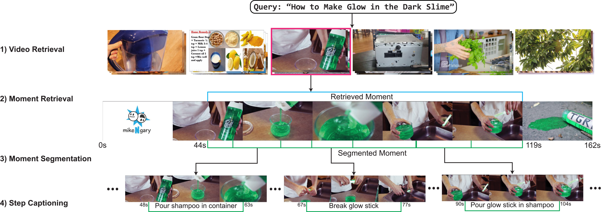
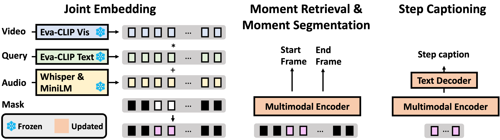

# Hierarchical Video-Moment Retrieval and Step-Captioning (CVPR 2023)

The code for [HiREST dataset](#hirest-dataset), [Joint baseline model](#joint-baseline-model), and [Colab demos](#notebooks), as described in the [CVPR 2023](https://cvpr2023.thecvf.com/) paper:

**[Hierarchical Video-Moment Retrieval and Step-Captioning](https://hirest-cvpr2023.github.io/)**

[Abhay Zala*](https://aszala.com),
[Jaemin Cho*](https://j-min.io),
[Satwik Kottur](https://satwikkottur.github.io),
[Xilun Chen](https://research.facebook.com/people/chen-xilun/),
[Barlas Oğuz](https://research.facebook.com/people/oguz-barlas/),
[Yasher Mehdad](https://scholar.google.com/citations?user=hFKgapkAAAAJ&hl=en),
[Mohit Bansal](https://www.cs.unc.edu/~mbansal/)

\*: Equal contribution


# HiREST Dataset

We present the <b>HiREST</b> (HIerarchical REtrieval and STep-captioning), a holistic, hierarchical benchmark of multimodal retrieval and step-by-step summarization for a video corpus.



## Annotations

`data/splits/` contains four annoataion files in json formats:

```bash
data/splits/
    # Train split
    # (546 queries / 1507 videos)
    all_data_train.json

    # Validation split
    # (292 queries / 477 videos)
    all_data_val.json

    # Test split
    # (546 queries / 1391 videos)
    all_data_test.json
    # (2891 videos)
    all_data_test_negative_samples.json # Additional videos that are only used for Video Retrieval task
```

Each json file can be read as a dictionary.
* key: text query (e.g., `"Make an Egg and Cheese Sandwich"`)
* value: dictionary of videos paired with the text query
  - relevant: `True` if the video is relevant to the query, `False` if the video is irrelevant to the query.
  - clip: `True` if the video moment is *clippable* (only <75% of the videos are relevant to the query), `False` if the whole video is relevant to the query.
  - v_duration: duration of the video in seconds
  - bounds: `[start, end]` of the video moment
  - steps: list of steps in the video moment (empty if `clip=False`)
    - index: index of the step
    - heading: step caption
    - absolute_bounds: `[start, end]` of the step
  
  Below is example video annotations paired with the query `"Make an Egg and Cheese Sandwich"`:
  ```json
  {
      "kMh-nG8axWI.mp4": {
          "relevant": true,
          "clip": false,
          "v_duration": 53.92,
          "bounds": [
              0,
              0
          ],
          "steps": []
      },
      "CAB-4KfX8x0.mp4": {
          "relevant": true,
          "clip": true,
          "v_duration": 354.97,
          "bounds": [
              43,
              290
          ],
          "steps": [
              {
                  "index": 0,
                  "heading": "Flip and twist ribbon",
                  "absolute_bounds": [
                      43,
                      60
                  ]
              },
              {
                  "index": 1,
                  "heading": "Hold them both",
                  "absolute_bounds": [
                      60,
                      70
                  ]
              },
              {
                  "index": 2,
                  "heading": "Repeat the process",
                  "absolute_bounds": [
                      70,
                      121
                  ]
              },
              {
                  "index": 3,
                  "heading": "Cut the ribbons",
                  "absolute_bounds": [
                      121,
                      130
                  ]
              },
              {
                  "index": 4,
                  "heading": "Put wire",
                  "absolute_bounds": [
                      130,
                      149
                  ]
              },
              {
                  "index": 5,
                  "heading": "Cut the excess",
                  "absolute_bounds": [
                      149,
                      179
                  ]
              },
              {
                  "index": 6,
                  "heading": "Tie it on package",
                  "absolute_bounds": [
                      179,
                      227
                  ]
              },
              {
                  "index": 7,
                  "heading": "Separate the ribbons",
                  "absolute_bounds": [
                      227,
                      257
                  ]
              },
              {
                  "index": 8,
                  "heading": "Cut extra ribbons",
                  "absolute_bounds": [
                      257,
                      290
                  ]
              }
          ]
      }
  }
  ```

## Evaluation

### Task 1: Video Retrieval

```bash
python evaluate.py --task video_retrieval --pred_data <path_to_model_output>
```
An example of pred_data might look like:
```json
{
    "Make a Monkey Out of Clay": {
        "videos": ["2gkPwJompWQ.mp4", ... ],
        "scores": [ 0.4589134, ... ],
        ...
    },
    ...
}
```

### Task 2: Moment Retrieval

```bash
python evaluate.py --task moment_retrieval --pred_data <path_to_model_output>
```
An example of pred_data might look like:
```json
{
    "Make a Monkey Out of Clay": {
        "2gkPwJompWQ.mp4": {
            "bounds": [
                40,
                100
            ]
        }
    },
    ...
}
```

### Task 3: Moment Segmentation

```bash
python evaluate.py --task moment_segmentation --preprocess_moment_bounds --pred_data <path_to_model_output>
```
An example of pred_data might look like:
```json
{
    "2gkPwJompWQ.mp4": {
        "bounds": [
            [ 40, 51 ],
            ...
        ],
        "pred_bounds": [ 40, 51, ... ],
        "target_bounds": [ 40, 48, ... ]
    },
    ...
}
```

### Task 4: Step Captioning

```bash
python evaluate.py --task step_captioning --pred_data <path_to_model_output>
```

The `evaluate.py` does not compute the CLIPScore by default, since CLIPScore requires video frames to compute the image-text similarity.
To compute CLIPScore, you need to provide the path to the frames directory `--frame_dir`, as follows.

```bash
python evaluate.py --task step_captioning --pred_data <path_to_model_output> --frame_dir ./data/raw_frames/
```

An example of pred_data might look like:
```json
{
    "2gkPwJompWQ.mp4": {
        "captions": [
            {
                "sentence": "take clay and blend as body"
            },
            ...
        ]
    },
    ...
}
```

# Joint Baseline Model

We prepare the code for the joint baseline model as a starting point for the 4 hierarchical tasks for HiREST.



## Install Packages

```bash
# Requires torch<1.13.0
# You need this only for step captioning evaluation (evaluate.py)
pip install allennlp_models

pip install -r requirements.txt
python -c "import language_evaluation; language_evaluation.download('coco')"
```

## Prepare Features

You can 1) download the pre-extracted visual (EVA-CLIP), and ASR (Whisper) and ASR embedding (MiniLM) from HiREST, or 2) extract features by yourself.


### 1) Download pre-extracted features
Download feature files extract them into the `./data/` directory.

For video retrieval task
```bash
# Visual features (EVA-CLIP) - 32 frames per video, including features from negative distractors
wget https://huggingface.co/j-min/HiREST-baseline/resolve/main/eva_clip_features_32_frame.zip
unzip -q eva_clip_features_32_frame.zip
mv eva_clip_features_32_frame/ data/
```

For moment retrieval / moment segmentation / step captioning tasks
```bash
# Speech transcripts (ASR with Whisper)
wget https://huggingface.co/j-min/HiREST-baseline/resolve/main/ASR.zip
# Speech embedding (MiniLM)
wget https://huggingface.co/j-min/HiREST-baseline/resolve/main/ASR_feats_all-MiniLM-L6-v2.zip
# Visual features (EVA-CLIP) - 1 frame per second
wget https://huggingface.co/j-min/HiREST-baseline/resolve/main/eva_clip_features.zip

unzip -q ASR.zip
unzip -q ASR_feats_all-MiniLM-L6-v2.zip
unzip -q eva_clip_features.zip

mv ASR/ data/
mv ASR_feats_all-MiniLM-L6-v2/ data/
mv eva_clip_features/ data/
```

Afterwards the `./data/` directory should look like: 
```bash
data/
    ASR/
    ASR_feats_all-MiniLM-L6-v2/
    eva_clip_features/
    eva_clip_features_32_frame/
    evaluation/
    splits/
```

### 2) Feature extraction (Optional)
Check out [extraction/README.md](extraction/README.md) for details.

<hr>

## Training on Single GPU

Before training, you need to download the weights of CLIP4Caption (to initialize multimodal encoder/decoder parameters) and EVA-CLIP-G (visual encoder and text query encoder).
As the [CLIP4Caption](https://github.com/liupeng0606/clip4caption) and [EVA CLIP](https://github.com/baaivision/EVA/tree/master/EVA-CLIP) repositories have been updated since our model development and also could be updated later, we uploaded the versions we used at (`clip4caption/` and `EVA_clip/`).


### Download Clip4Caption weights
Please download the clip4caption pretrained weights [here](https://drive.google.com/file/d/17p476sL5_KZoQ2h4e1TU7-qWH4VqzReT/view?usp=sharing) and put them in `./pretrained_weights/`.

```bash
wget https://huggingface.co/j-min/HiREST-baseline/resolve/main/clip4caption_vit-b-32_model.bin
mv clip4caption_vit-b-32_model.bin ./pretrained_weights/clip4caption_vit-b-32_model.bin
```

### Download EVA-CLIP weights
Please download the EVA-CLIP pretrained weights [here](https://huggingface.co/BAAI/EVA/blob/main/eva_clip_psz14.pt) and put them in `./pretrained_weights/`.

```bash
wget https://huggingface.co/BAAI/EVA/resolve/main/eva_clip_psz14.pt
mv eva_clip_psz14.pt ./pretrained_weights/eva_clip_psz14.pt
```


### Run Training
Change `output` variable at the top of `scripts/run.sh` to change model checkpoint path.
We used a 1080 TI GPU (11GB memory) with batch size 5.

To run training (and automatically run inference) run:
```bash
bash scripts/run.sh --train
```

### Pretrained joint model weights (Optional)
```bash
wget https://huggingface.co/j-min/HiREST-baseline/resolve/main/HiREST_BEST.pth
mv HiREST_BEST.pth ./checkpoints/hirest_joint_model/BEST.pth
```

## Inference & Evaluation

### Video Retrieval

```bash
# Inference
python inference_video_retrieval.py \
    --data_dir './data/splits' \
    --video_feature_dir './data/eva_clip_features_32_frame' \
    --optim adamw \
    --n_model_frames 20 \
    --num_workers 4 \
    --eval_batch_size 10 \
    --device 'cuda' \
    --video_retrieval_model 'clip_g' \
    --run_name clip_g_VR_20frames_avgpool

# Evaluation
python evaluate.py \
    --task video_retrieval \
    --pred_data VR_results/clip_g_VR_20frames_avgpool.json
```

### Moment Retrieval / Moment Segmentation / Step Captioning

```bash
# Inference
bash scripts/run.sh

# Evaluation
bash scripts/score.sh
```

# Notebooks 
- Inference and evaluation of video retrieval task with our joint baseline model (EVA CLIP-G) on HiREST test split: [](https://colab.research.google.com/github/j-min/HiREST/blob/main/video_retrieval_inference_and_evaluation.ipynb)

- Inference and evaluation of moment retrieval / moment segmentation / step captioning tasks with our joint baseline model on HiREST val split: [](https://colab.research.google.com/github/j-min/HiREST/blob/main/val_inference_and_evaluation.ipynb)

- Inference on custom video with our joint baseline model: [](https://colab.research.google.com/github/j-min/HiREST/blob/main/custom_video_pipeline.ipynb)


# Acknowledgements

Our project borrows code from the following repositories:
- https://github.com/UKPLab/sentence-transformers (Sentence-Transformers - MiniLM),
- https://github.com/openai/whisper (Whisper),
- https://github.com/liupeng0606/clip4caption (CLIP4Caption),
- https://github.com/baaivision/EVA/tree/master/EVA-CLIP (EVA-CLIP)

We thank for the authors of the repositories for their public release of code.

# Citation
Please cite our paper if you use our dataset and/or method in your projects.

```bibtex
@inproceedings{Zala2023HiREST,
  author    = {Abhay Zala and Jaemin Cho and Satwik Kottur and Xilun Chen and Barlas Oğuz and Yashar Mehdad and Mohit Bansal},
  title     = {Hierarchical Video-Moment Retrieval and Step-Captioning},
  booktitle = {CVPR},
  year      = {2023},
}
```
